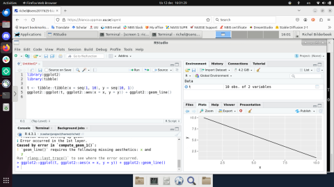

---
tags:
  - lesson
  - session
---

# IDEs



> RStudio is one of the IDEs that can be used on Bianca.

!!! info "Objectives"

    - Find information in the UPPMAX documentation about IDEs on Bianca
    - Give a reasonable definition of what an IDE is
    - Remember that RStudio, Jupyter, VSCodium and MATLAB are IDEs that can be run on Bianca
    - Can run the favorite IDE on Bianca
    - (optional) Can give a reason why to use an IDE
    - (optional) Can give a reason why not to use an IDE on Bianca
    - (optional) Can give a reason why not to run an IDE on a login node
    - (optional) Can give a reason when to use an interactive session
    - (optional) Can find out if an interactive session is active

???- info "Notes for teachers"

    Teaching goals:

    - The learners have explored the UPPMAX documentation
    - The learners have seen that there are different IDEs on Bianca
    - The learners have start at least one IDE on Bianca
    - The learners understand why to use an IDE
    - The learners understand why not to use an IDE on Bianca
    - The learners understand when to run an IDE on a login node
    - The learners understand when to use an interactive session
    - The learners understand how to find out an interactive session is active

    Lesson plan:

    ```mermaid
    gantt
      title IDEs
      dateFormat X
      axisFormat %s
      Introduction: intro, 0, 5s
      Decide on IDE and create BO:, after intro, 5s
      Exercise in IDE-specific rooms: exercise, 15s
      Feedback: feedback, after exercise, 3s
      Monologue: monologue, after feedback, 2s
      Break: milestone, after monologue
    ```

## Why?

You want to develop/modify code on Bianca in a program ...

- ... that you already use on your regular computer
- ... that is not the terminal
- ... that helps you do so by providing code completion,
      code hints, run-time debugging, etc.

Hence, you want to use an IDE.

IDE (pronounce `aj-dee-ee`) is short for 'Integrated Development Environment',
or 'a program in which you do programming'.
The goal of an IDE is to help develop code, with features
such as code completion, code hints and interactive debugging.

Using an IDE on Bianca is cumbersome and
there are superior ways to develop code on Bianca,
as -for example- taught in the
[UPPMAX 'Programming Formalisms' course](https://uppmax.github.io/programming_formalisms/learning_outcomes/).

There are four [IDEs on Bianca](http://docs.uppmax.uu.se/software/ides_on_bianca/)

- Jupyter, RStudio, VSCodium, MATLAB

You will choose one and dig into that one.

## Exercises

### Exercise 0: determine which IDE

Tool | Language(s) | Comment
-----|-------------| -------
RStudio| R         | Good for various working methods
MATLAB| MATLAB      | Good for various working methods
VSCodium | All      | Very versatile but a bit difficult to work with
Jupyter| Python (R, Julia) | More notebook like

- If you are not used to any of these I recommend RStudio.

- Use the Zoom breakout room for your favorite IDE

### Exercise 1: Understand IDEs on Bianca

???- info "Learning outcomes"

    - Explore the UPPMAX documentation
    - Understand why to use an IDE
    - Understand why not to use an IDE on Bianca
    - Understand that a ThinLinc session is needed
    - Understand when to run an IDE on a login node
    - Understand when to use an interactive session
    - Understand how to find out an interactive session is active

- Try to answer the questions below.
  Be generous in accepting you answer.
  If you have no idea, use the UPPMAX documentation of the [IDEs on Bianca](http://docs.uppmax.uu.se/software/ides_on_bianca/).
  When done, run the other two IDEs on Bianca

???- question "Why use an IDE?"

    It makes new Bianca users feel comfortable,
    as an IDE is a recognizable environment.
    Also, the terminal can be daunting to some.

    Additionally, an IDE allows one to do runtime debugging,
    i.e. running through code line-by-line and/or up/down
    the so-called call stack.

???- question "Why use ThinLinc (web) when working with IDEs?"

    - IDEs are by definition graphical tools and needs graphics libraries.
    - SSH login to Bianca does not support graphics.
    - Therefore you need the remote desktop.
        - See [Which way to log in to Bianca](https://docs.uppmax.uu.se/getting_started/login_bianca/#which-way-to-log-in-to-bianca).

???- question "Why not always use an IDE?"

    Using an IDE on Bianca is cumbersome and
    there are superior ways to develop code on Bianca,
    as -for example- taught in the
    [UPPMAX 'Programming Formalisms' course](https://github.com/UPPMAX/programming_formalisms).

???- question "Is it OK to run IDEs on a login node? Why yes/no?"

    No. IDEs are big programs, use an interactive session instead.

    You could argue if you are the only one on a Bianca project,
    you code use the login node. This only works if the IDE
    works fine on such limited computational resources.

    ???- tip

        - Allocate at least 2 cores: ``... -n 2 ...``.
        - If you are working with large data sets, allocate 7 GB per core, like 8, to get 56 GB.

???- question "Why not always use an interactive session?"

    Because it is an inefficient use of your core hours.

    An interactive session means that you use a calculation node with low
    efficiency: only irregularly you will use such a node to its full
    capacity.
    However, the number of core hours are registered as if the node is used
    at full capacity, as it is _reserved_ to be used at that capacity.

???- question "How to find out if you are on a login or interactive node?"

    In the terminal, type `hostname`

    - the login node has `[project]-bianca`, where `[project]` is the name of the project, e.g. `sens2025560`
    - the interactive node has `b[number]` in it, where `[number]` is the compute node number

### Exercise 2: Start the favorite IDE

???- info "Learning outcomes"

    - Explore the UPPMAX documentation
    - Start the favorite IDE on Bianca

- Go to the UPPMAX documentation of the [IDEs on Bianca](http://docs.uppmax.uu.se/software/ides_on_bianca/)
- If you think it is necessary, start an interactive session. [How was this done?](https://uppmax.github.io/bianca_workshops/beginner/slurm_intro/#procedure-for-interactive-jobs)
- Start the IDE of your choice.

??? tip "Answer"

    - [Jupyter](https://docs.uppmax.uu.se/software/jupyter_on_bianca/)
    - [RStudio](https://docs.uppmax.uu.se/software/rstudio_on_bianca/)
    - [VSCodium](https://docs.uppmax.uu.se/software/vscodium_on_bianca/)
    - [Matlab](https://docs.uppmax.uu.se/software/matlab/#the-matlab-module)

## Keypoints

??? question "Do you lack an IDE on Bianca?"

    - Give some input to us.

## Summary

!!! abstract "Keypoints"

    - There are (at least) 4 IDEs instaleld on Bianca
    - How to start the mare descibed in the documentation
    - ThinLinc remote desktop is needed.
    - Starting an interactive session on a compute node is recommended.
