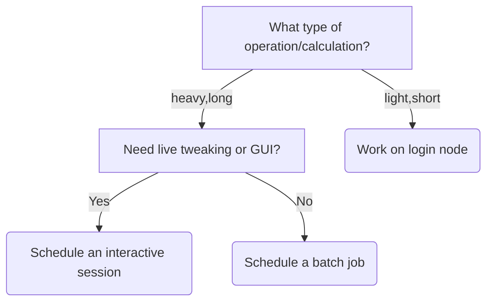
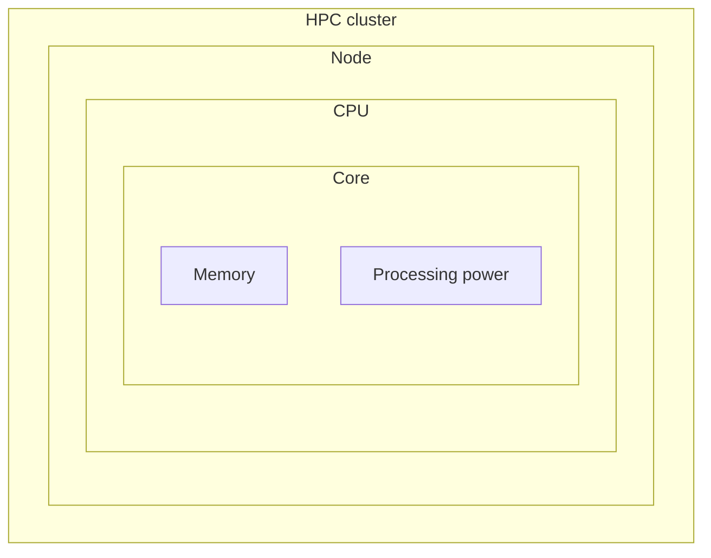
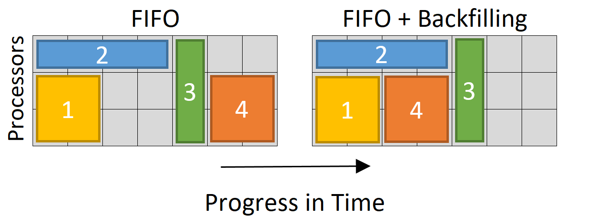

# Job scheduler

!!! info "Learning outcomes"

    - Learners have scheduled a batch job
    - Learners have scheduled an interactice job
    - Learners have seen their job in the job queue
    - Learners have cancelled their job in the job queue

## Goal

In this session, you will schedule a short batch job,
a long batch job and an interactive session. The long batch
job will be cancelled.

Non-goals:

- [How to schedule jobs that require GPUs](../../intermediate/gpu.md)
- [How to schedule jobs that use Bianca efficiently](../../intermediate/efficient_jobs/README.md)
- [How to schedule jobs that require more memory](../../intermediate/efficient_jobs/README.md)

## Theory 1

## What is a job scheduler?

You use the job schedule to:

- ask it to do a hard calculation
- ask it for an interactive session

```bash
sbatch -A sens2025560 my_job_script.sh
interactive -A sens2025560
```

Here are some example job scripts:

=== "Python"

    ```bash
    #!/bin/bash
    module load python
    python my_calculation.py
    ```

=== "R"

    ```bash
    #!/bin/bash
    module load R
    Rscript my_calculation.R
    ```

## When to use the job scheduler?

When you want to do more than work on the login node.

What to do        |How to do so
------------------|--------------------------------
Light things      |Work on login node
Interactive work  |Schedule an interactive session
Heavy calculations|Schedule a batch job



## Why use a job scheduler?

The job scheduler makes sure everyone gets their fair share of computational
power.

You just need to ask it to schedule your calculation or interactive session.

## Exercises 1

### Exercise 1.1: schedule a batch job

Create the following Bash script, called `job_scheduler_exercise_1.sh`:

```bash
#!/bin/bash
echo "Exercise 1.1"
```

Run it by:

```
sbatch -A sens2025560 job_scheduler_exercise_1.sh
```

???- question "How does that look like?"

    It will look similar to this:

    ```bash
    [richel@sens2025560-bianca ~]$ sbatch -A sens2025560 job_scheduler_exercise_1.sh
    Submitted batch job 623
    ```

### Exercise 1.2: schedule, monitor and cancel a job

Create the following Bash script, called `job_scheduler_exercise_2.sh`:

```bash
#!/bin/bash
#SBATCH --time=239:59:59
#SBATCH -n 16
sleep 1h
echo "Exercise 1.2"
```

Run it by:

```bash
sbatch -A sens2025560 job_scheduler_exercise_2.sh
```

???- question "How does that look like?"

    It will look similar to this:

    ```bash
    [richel@sens2025560-bianca ~]$ sbatch -A sens2025560 job_scheduler_exercise_2.sh
    Submitted batch job 624
    ```

### Exercise 1.3: schedule an interactive session

Schedule an interactive session:

```bash
interactive -A sens2025560 
```

You will directly see that Bianca is doing something.

???- question "How does that look like?"

    It will look similar to this:

    ```bash
    [richel@sens2025560-bianca ~]$ interactive -A sens2025560
    You receive the high interactive priority.
    You may run for at most 12 hours.
    Please note that in 12 wallclock hours this interactive job will use 192 core hours.

    Please, use no more than 14 GB of RAM.

    Waiting for job 622 to start...
    ```

## Theory 2

### Working with the job scheduler

There are multiple commands to work with the job scheduler:

Command      |Purpose
-------------|---------------------------------------
`sbatch`     |Ask to schedule of a batch job
`interactive`|Ask to schedule an interactive session
`squeue`     |View the job queue
`scancel`    |Cancel a running job

The `s` (in the commands that start with an `s`)
is named after the job scheduler, which is called Slurm.

### Cluster architecture

We have been using the word 'node' quite a bit already,
without specifying what it is exactly.

Here is a simplified picture of HPC cluster architecture:



<!-- markdownlint-disable MD013 --><!-- Tables cannot be split up over lines, hence will break 80 characters per line -->

Term               |What it loosely is                              |Amount
-------------------|------------------------------------------------|---------------
Core               |Something that does a calculation               |One or more per CPU
CPU                |A collection of cores that share the same memory|One or more per node
Node               |A collection of CPUs that share the same memory |One or more per HPC cluster
HPC cluster        |A collection of nodes                           |One or more per universe

<!-- markdownlint-enable MD013 -->

You can find the exact amount of cores, CPUs and nodes
Bianca has in
[the UPPMAX documentation page 'Bianca hardware'](https://docs.uppmax.uu.se/hardware/clusters/bianca/).
For this session, this is irrelevant.

### How long will it take until a scheduled job starts

One cannot predict how long it will take until a scheduled job stats,
but it will help to know how scheduling takes place.

Here is an image of how jobs are scheduled:



To maximize the usage of its computing power,
the Bianca job scheduler works on the first-in-first-out-with-backfill
principle. From understanding this principle, it follows that:

- Jobs that are submitted earlier get scheduled earlier
- If there are less jobs scheduled than resources available,
  jobs start directly. You can see this at
  [the Bianca usage page](https://status.uppmax.uu.se/usage/)
- Jobs that use less time *may* be scheduled earlier
- Jobs that use less cores *may* be scheduled earlier

## Exercises 2

## Exercises 2.1: an interactive session

!!! warning "Assumptions"

    This exercise assumes that your interactive job has started.
    If your interactive job has not started:

    - skip this exercise
    - connect to Bianca in an other terminal for the next exercises
      and do this exercise later

Taking a look at the screen,
you can see that your interactive session has started.

???- question "How does that look like?"

    It will look similar to this:

    ```bash
     
     _   _ ____  ____  __  __    _    __  __
    | | | |  _ \|  _ \|  \/  |  / \   \ \/ /   | System:    sens2025560-b9
    | | | | |_) | |_) | |\/| | / _ \   \  /    | User:      richel
    | |_| |  __/|  __/| |  | |/ ___ \  /  \    |
     \___/|_|   |_|   |_|  |_/_/   \_\/_/\_\   |

    ###############################################################################

            User Guides: http://www.uppmax.uu.se/support/user-guides
            FAQ: http://www.uppmax.uu.se/support/faq

            Write to support@uppmax.uu.se, if you have questions or comments.


    [richel@sens2025560-b9 ~]$
    ```

How can we see that we are not on a login node anymore?

???- question "Answer"

    We can see that the prompt has changed and no longer shows `bianca`
    but a `b` with a number instead:

    Example                         |Location/session
    --------------------------------|-------------------
    `[richel@sens2025560-bianca ~]$`|Login node
    `[richel@sens2025560-b9 ~]$`    |Interactive session


### Exercise 2.2: view the results of a successful script

The first job you submitted was short and has now finished.
It has created a file with its output.

List all the files in your folder.

???- question "Answer"

    Use the `ls` command to list all files in your current folder.
    
    Your output will look similar to this:

    ```bash
    [richel@sens2025560-bianca ~]$ ls
    bin	 job_scheduler_exercise_1.sh  slurm-623.out
    Desktop  job_scheduler_exercise_2.sh  slurm-624.out
    ```

By default the Bianca job scheduler, called Slurm,
will create output files named after itself
and the job number.

Display the file of the first job you submitted.

???- question "Answer"

    Use the `cat` command to display a file.
    
    Your output will look similar to this:

    ```bash
    [richel@sens2025560-bianca ~]$ cat slurm-623.out
    Exercise 1.1
    ```

### Exercise 2.3: view the job queue and cancel a job

The second jou you submitted will take quite long.
In this exercise, we *may* see it waiting in the queue.

The script has booked the maximum time a Bianca job can run.
What is this maximum time?

???- question "Answer"

    ```bash job_scheduler_exercise_2.sh
    #!/bin/bash
    #SBATCH --time=239:59:59
    #SBATCH -n 16
    sleep 1h
    echo "Exercise 1.2"
    ```

    The line to look for is `time`, which has nearly 240 hours scheduled.
    Indeed, 10 days is the maximum on Bianca.
    
The script has booked the maximum amount of cores on a Bianca node.
What is this maximum amount of cores?

???- question "Answer"

    ```bash job_scheduler_exercise_2.sh
    #!/bin/bash
    #SBATCH --time=239:59:59
    #SBATCH -n 16
    sleep 1h
    echo "Exercise 1.2"
    ```

    The line to look for is `n`, which has 16 cores scheduled.
    Indeed, 16 cores is the maximum (for a single-node job).


View the job queue.

???- question "Answer"

    Use the `squeue` command to display the Slurm queue.
    
    Your output will look similar to this:

    ```bash
     JOBID PARTITION     NAME     USER ST       TIME  NODES NODELIST(REASON)
       625      core job_sche   richel  R       0:03      1 sens2025560-b9
    ```

Is your job running or pending?

???- question "Answer"

    If the job is running, you will see how long it is running,
    for example, the job below has been running for 3 seconds:
    
    ```bash
     JOBID PARTITION     NAME     USER ST       TIME  NODES NODELIST(REASON)
       625      core job_sche   richel  R       0:03      1 sens2025560-b9
    ```

    If your job is pending, it will look similar to this:

    ```bash
     JOBID PARTITION     NAME     USER ST       TIME  NODES NODELIST(REASON)
       628      node job_sche   richel PD       0:00      1 (Nodes required for job are DOWN, DRAINED or reserved for jobs in higher priority partitions)
    ```

Whatever your job is doing,
we are going to cancel it.

Cancel the job.

???- question "Answer"

    Use the `scancel` command to cancel a job.
    You will need to supply the number of the job.
    
    Your output will look similar to this:

    ```bash
    [richel@sens2025560-bianca ~]$ scancel 625
    ```

Check the queue if the cancellation worked.

???- question "Answer"

    If the job is busy cancelling, your output will be similar to this:
    
    ```bash
    [richel@sens2025560-bianca ~]$ squeue
                 JOBID PARTITION     NAME     USER ST       TIME  NODES NODELIST(REASON)
                   625      core job_sche   richel CG       0:13      1 sens2025560-b9
    ```

    If you wait a couple of seconds longer,
    the job has cancelled and your output will be similar to this:

    ```bash
    [richel@sens2025560-bianca ~]$ squeue
                 JOBID PARTITION     NAME     USER ST       TIME  NODES NODELIST(REASON)
    ```

Of the cancelled job, view the Slurm log file.
How does it look like?

???- question "Answer"

    Use `cat` to view a file.
    
    Your output will look similar to this:

    ```bash
    [richel@sens2025560-bianca ~]$ cat slurm-625.out
    slurmstepd: error: *** JOB 625 ON sens2025560-b9 CANCELLED AT 2026-09-17T14:52:32 ***
    ```


## Some real job scripts


## FAQ


???- question "How many cores in a compute/login node?"

    - On a compute node, there are 16 cores in one node.
    - On a login node, there are 2 cores which are shared among all the project members.

???- question "How much memory in a compute/login node?"

    - On a compute node, you have 128, 256, 512 GB variants.
      By default, you get 128 GB unless you request more memory
      using the `-C` flag, e.g. `-C mem256GB`
    - On a login node, you have 16GB memory only.

???- question "Do you have GPUs?"

    - Bianca has 10 nodes with 2xA100 40GB GPUs per node.
    - Use `-C gpu` flag to request a GPU node.
      To request 1 GPU, use `-C gpu --gpus_per_node=1`
    - GPU nodes have 256 GB memory.

???- question "What is the maximum limit my job can run for?"

    - Job walltime for a job on interactive session is limited to 12 hrs
      and on compute node to 10 days.
    - Send us a ticket, with justification, via Supr if you like to extend your job beyond this limit.

## Links

- [New Slurm user guide](https://uppmax.github.io/UPPMAX-documentation/cluster_guides/slurm/)
- [Discovering job resource usage with `jobstats`](https://docs.uppmax.uu.se/software/jobstats/)
- [Plotting your core hour usage](https://docs.uppmax.uu.se/software/projplot/)
- [The job scheduler graphically](https://docs.uppmax.uu.se/cluster_guides/slurm_scheduler/)
- [Official slurm documentation](https://slurm.schedmd.com/)
