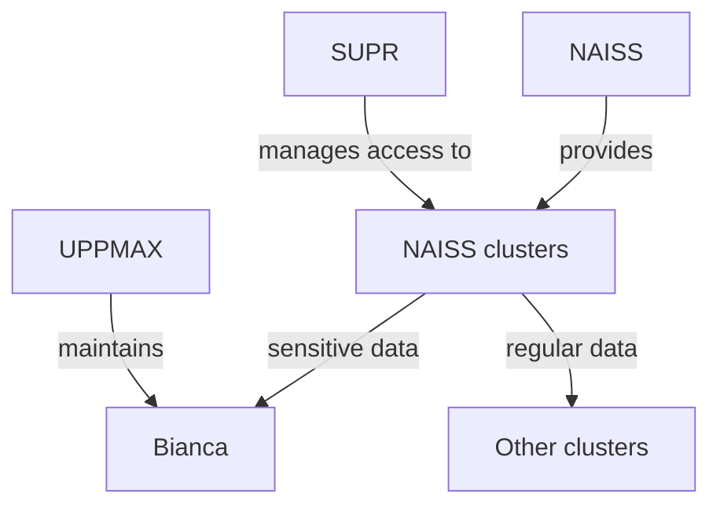

---
tags:
  - lesson
  - session
  - NAISS
  - sens
  - legal
  - sensitive
---

# Intro to NAISS-SENS

!!! info "Objectives"

    - Understand the role of Bianca in Sweden
    - Understand how to apply for a sensitive data project
    - Understand who to contact with questions

???- question "For teachers"

    Priors:

    - As a Sweden-wide server, what is the unique purpose about Bianca?
    - What are features unique to a sensitive data cluster?
    - Why does Bianca have no direct internet connection?
    - Why does one need 2FA to login to Bianca?
    - Why does one need to type a password twice?
    - How does one apply to a Bianca project?

## The role of Bianca in Sweden

Bianca is the only national HPC cluster for sensitive data.
Sensitive data is any data that can cause harm, e.g. to an individual's privacy.
Such data is protected by law and UPPMAX has procedures in place to ensure
these are followed.

## Exercises

### Exercise 1: apply for a Bianca project

Go to the UPPMAX documentation at
[https://docs.uppmax.uu.se](https://docs.uppmax.uu.se),
then answer these questions:

- Where is it is described how to apply for a Bianca project?

???- question "Answer"

    Search for 'Bianca project'.

    The page is at 
    <https://docs.uppmax.uu.se/getting_started/project_apply_bianca/>

- Apply for a project, **except for actually submitting it**;
  we will cancel the proposal in the end.
  Take the time to actually read the text.
  Keep track of the extra documents you need. 
  Follow the procedure described at the UPPMAX documentation.

- Which documents do you need? Who to contact for questions?

???- question "Answer"

    For non-Uppsala researchers, they need a
    Data Processing Agreement/`Personuppgiftsbiträdesavtal`/PUBA
    as described [here](https://www.uu.se/en/centre/uppmax/get-started/create-account-and-apply-for-project/apply-for-projects/applying-for-naiss-sens-project/puba).
    If you are lucky, there is a general Data Processing Agreement,
    else you need to contact the person at the bottom
