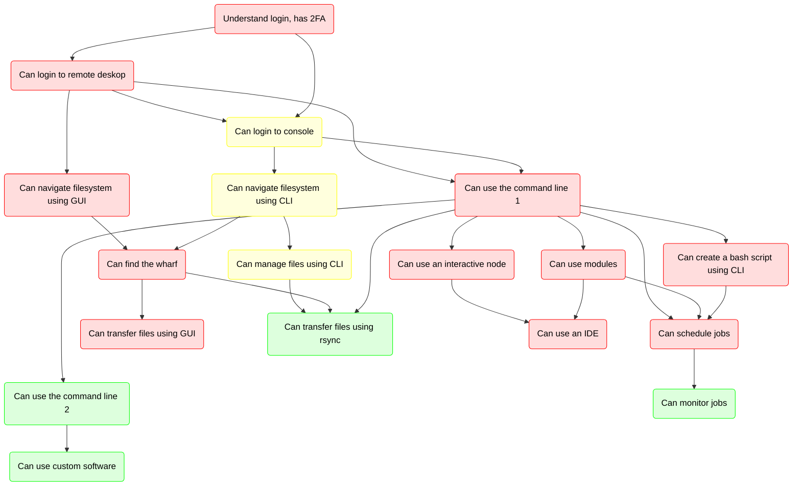

# Summary

Learning outcomes of this course:

- I can log in to the Bianca remote desktop using the website
- :rocket: I can log in to the Bianca console environment using SSH
- I can navigate to the wharf folder using a graphical file manager
- I can manage my files and folders using a graphical file manager
- :rocket: I can navigate to the `wharf` folder using a terminal
- :rocket: I can manage my files and folders using a terminal
- I can create a Bash script
- I can use modules
- I can transfer files to/from Bianca using a graphical tool
- I can start an interactive session
- I can submit jobs to the scheduler
- I can start an IDE

The items with :rocket: are optional.

This course and its relation to the Bianca Intermediate course:

> Overview of the courses.
> Red nodes: Intro to Bianca.
> Yellow node: Intro to Bianca extra material.
> Green node: Intermediate Bianca.

Possible next steps:

<!-- markdownlint-disable MD013 --><!-- Tables cannot be split up over lines, hence will break 80 characters per line -->

I want to ...                   |Solution
--------------------------------|-------------------------------
work smarter with Bianca        |Attend [the 'Bianca Intermediate' course](https://uppmax.github.io/bianca_workshops/intermediate/intro/)
do my computational work smarter|Attend [the 'Programming Formalisms' course](https://uppmax.github.io/programming_formalisms/)
transfer files smarter          |Attend [the NAISS 'File Transfer' course](https://uppmax.github.io/naiss_file_transfer_course/)
work smarter on the command line|Attend [the NAISS 'Command line 101' course](https://nbisweden.github.io/SCoRe_user_doc/courses/)
find out what courses there are |See [the SCoRe overview of courses](https://nbisweden.github.io/SCoRe_user_doc/courses/)

<!-- markdownlint-enable MD013 -->
