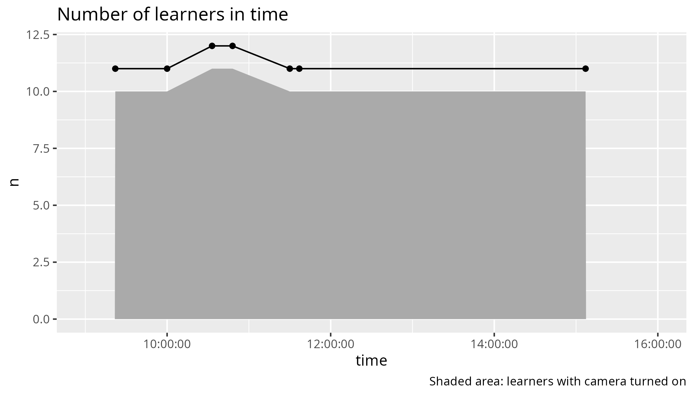

---
tags:
  - counts
  - 2025-03-19
  - data
---

# 2025-03-19

## Number of learners present in time

- Data: [20250319_counts.csv](20250319_counts.csv)
- Code: [analyse_counts.R](analyse_counts.R)

