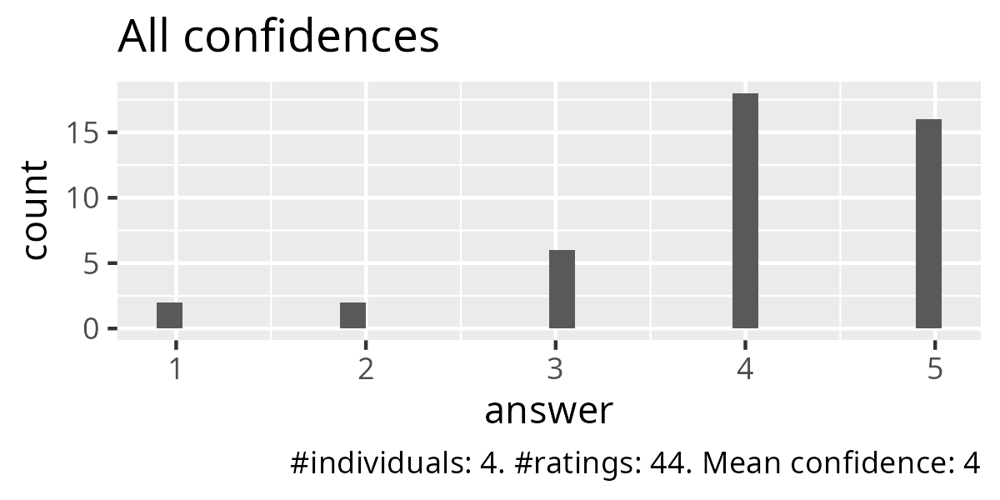
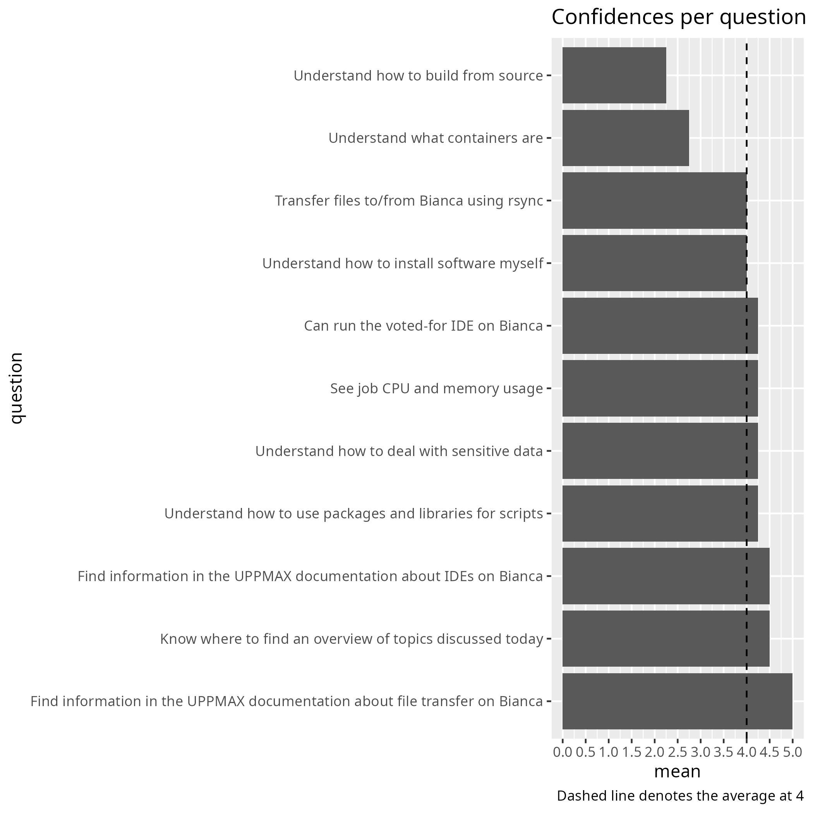
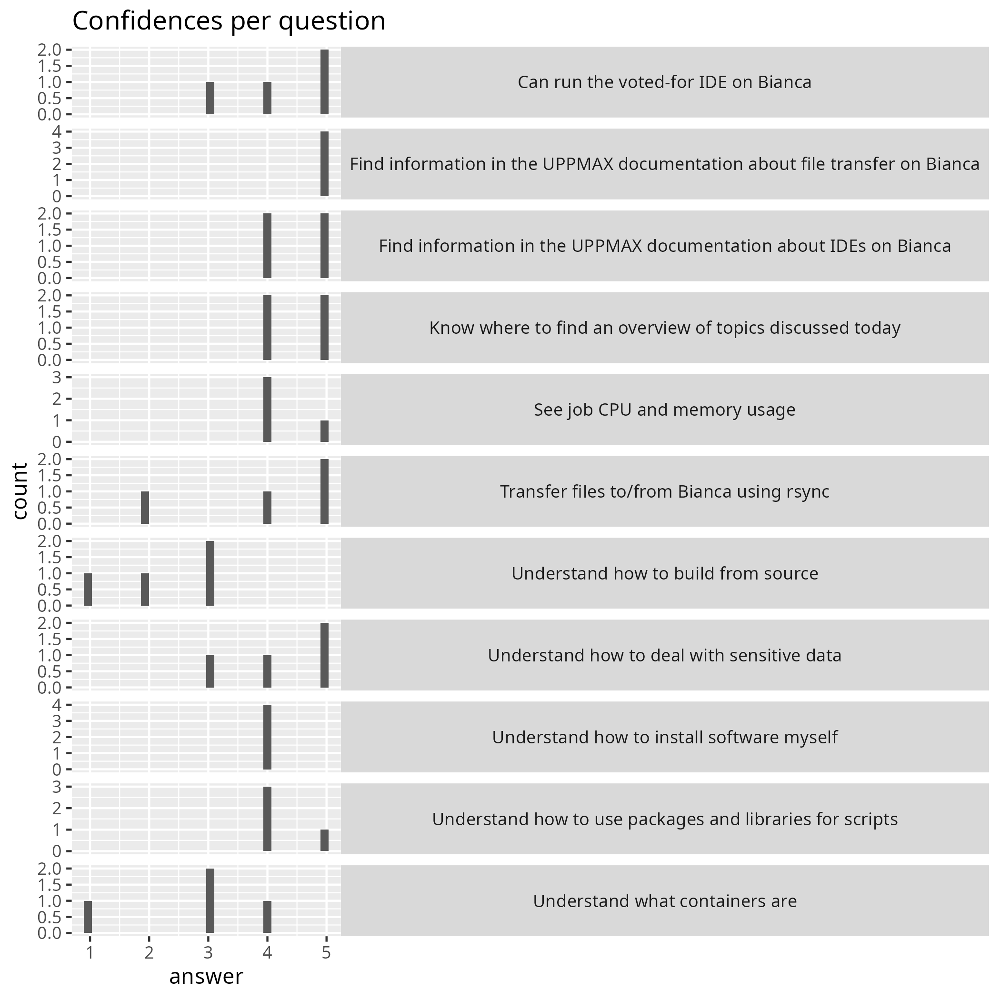

---
tags:
  - evaluation
---

# Evaluation 2024-05-24

- Course: Bianca intermediate workshop
- Reflections: [Richel](../../reflections/20240524/README.md)
- [Number of learners in time (csv)](20240524_counts.csv)
- [Evaluation results (csv)](20240524.csv)
- [Analysis script (R)](analyse.R)
- [Average confidences (csv)](average_confidences.csv)
- [Success score](success_score.txt): 80%

