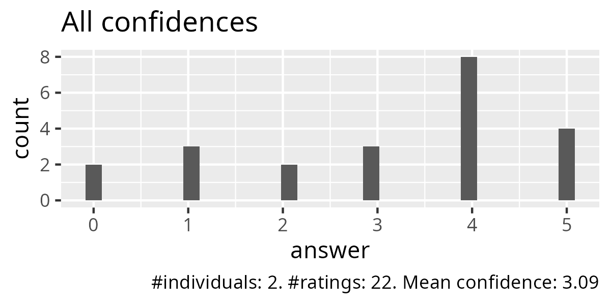
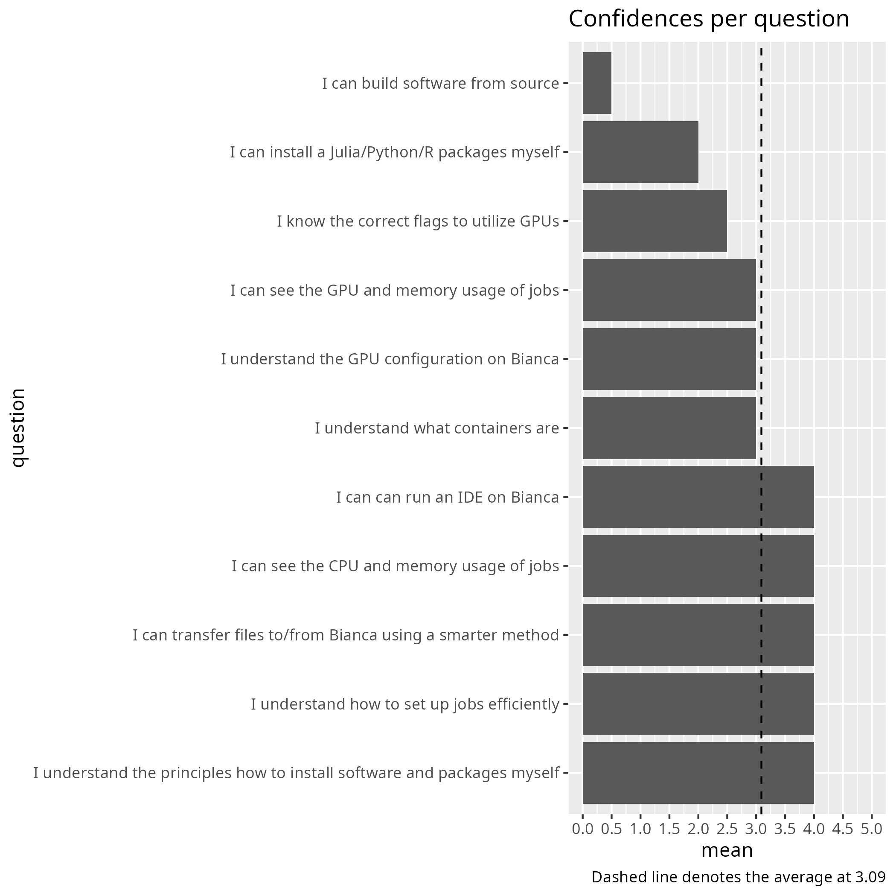
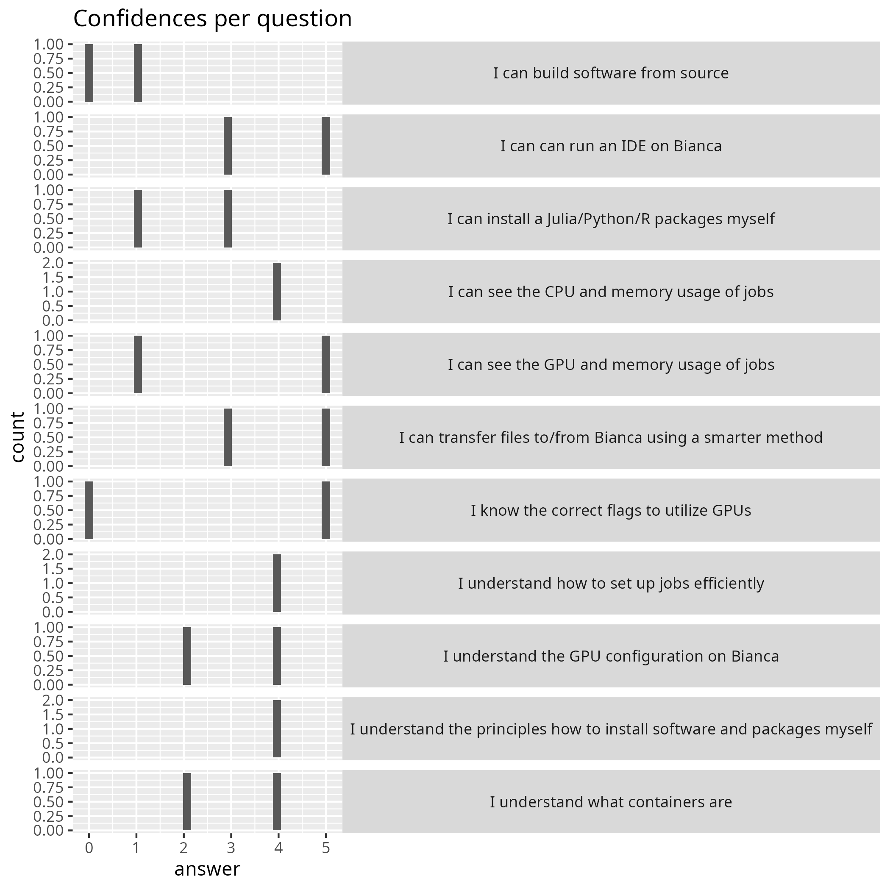

---
tags:
  - evaluation
  - 20250523
  - 2025-05-23
---

# Evaluation Bianca Intermediate

- [Lesson plan](../../lesson_plans/20250523/20250523_richel.md)
- [Evaluation](../../evaluations/20250523/README.md)
- [Reflection](../../reflections/20250523/20250523_richel.md)
- [Analysis script (R)](analyse.R)
- [average_confidences.csv](average_confidences.csv)
- [success_score.txt](success_score.txt): 0.62

## [comments.txt](comments.txt)

- I understand that sometimes there is not time to check that instructions/code for exercises still work before giving the course. But, I would still like to learn how to install python packages onto Bianca. Would it be possible to notify us when the instructions have been updated? Overall, I thought the teaching was great. All teachers were enthusiastic and knowledgable. Maybe there could be more time for questions during each section?
- It would be good if more students were involved in courses like this. All the instructors did an excellent job. However, during the course, Bianca was not working, so we were unable to complete our exercises.
