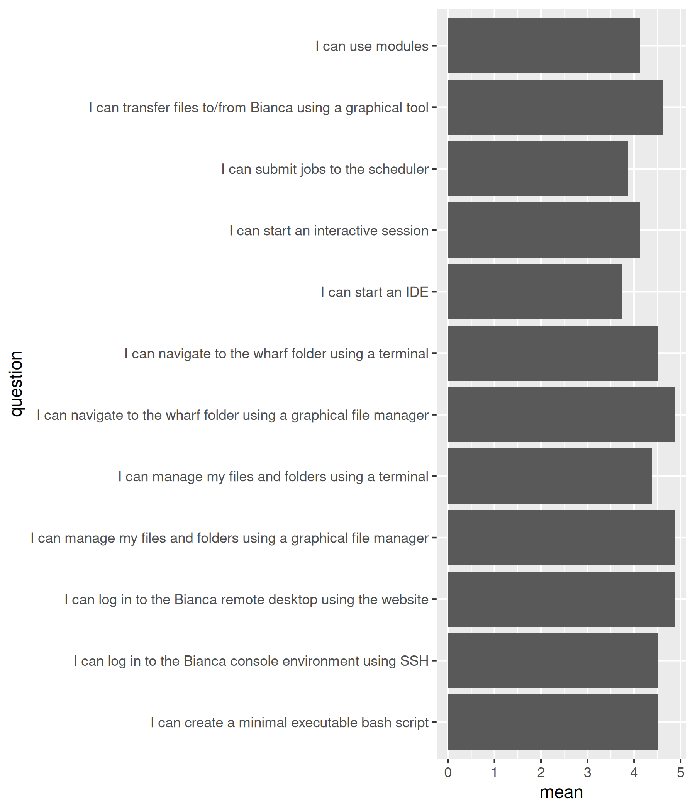

# Evaluation

- Course: Basic
- Date: 2025-09-15
- Number of registrations: 23
- Number of learners showing up: ~12 (52% show-up rate)
- Number of evaluation results: 8 (67% fill-in rate)
- [Analysis script](analyse.R)
- [Success score](success_score.txt): 88%
- [Evaluation results](evaluation_result.csv)
- [Any feedback results](any_feedback.cvs)

## Confidences

- [Average confidences as a table](average_confidences.csv)

## Say something positive about Björn

- very calm and knowledgeable
- great guy!
- organized, helped with login before the seminar

## Say something about Björn he can improve

[no feedback]

## Say something positive about Jayant

- very calm and loved the mentimeter
- great guy!
- organized and helpful

## Say something about Jayant he can improve

[no feedback]

## Say something positive about Pavlin

- Loved his transparency about the complexity of the commands
- clear instructions!
- organized and helpful

## Say something about Pavlin he can improve

[no feedback]

## Say something positive about Richèl

- Loved his energy!
- Very structured and clear, which is highly appreciated.
  Good with the "cold calls".
- Such a positive person and very good at getting students to teach each other
- organized and helpful

## Say something about Richèl he can improve

[no feedback]

## Any other feedback?

- Perhaps provide the respective Bianca workshop links before the course
  (unless you have already done so and I missed it...),
  so one can get a bit more familiar with some terms?
  Every teacher did a good job, so no individual feedback here.
  It was rather the topics that were challenging at different levels,
  depending on the existing (or non-existing) background knowledge
  that made it easier or difficult to follow
  (hence, perhaps "force" the course participants to complete
  some reading-up before the course, or make them watch certain videos, etc.,
  that you feel are important for understanding everything).
  Could be done in the Canvas platform for example where you can also see
  if someone has not done the respective task. 
- Gentle introduction to the topics, good pace, good selection of topics.
- The course is super helpful and thanks to all the instructors!

## [Any feedback](any_feedback.cvs)

Love the team's energy and teaching styles,
it made it easier to follow
even though there were different teaching styles as well.

Richèl was a good energetic anchor and interactive teacher,
Pavlin was a transparent teacher that encouraged extra-curricular knowledge,
and jayant was very calm and knowledgeable.
Love that he gave a summary of the course progress
before he started his section too.

