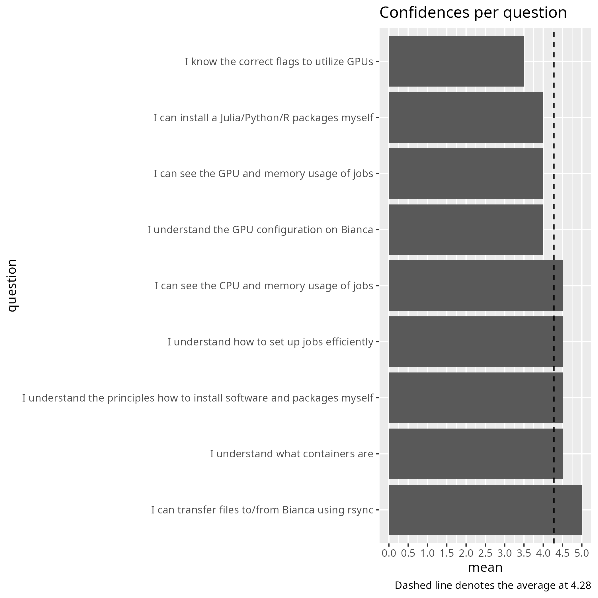

# Evaluation

- Date: 2025-11-17
- Course: Intermediate
- [Lesson plan](../../lesson_plans/20251117/20251117_richel.md)
- [Evaluation](../../evaluations/20251117/README.md)
- [Reflection](../../reflections/20251117/20251117_richel.md)
- [Analysis script (R)](analyse.R)
- [average_confidences.csv](average_confidences.csv)
- [success_score.txt](success_score.txt): 86%

## [comments.txt](comments.txt)

- Sometimes the instructions on the course page
  were a little hard to follow with a lot of pointing to other pages
  (understandable, to not have duplicate information)
  and similar information repeated (first as principles,
  then as step-by-step-instructions).
  But other than that it was a pedagogic and helpful course!
- It's a very good and detailed seminar and teachers are very nice
  and give many useful tips. Highly recommend !

## Pre-post analysis

- [analyse_pre_post.R](analyse_pre_post.R)
- [stats.md](stats.md)

|question                                                                | mean_pre| mean_post|   p_value|different |
|:-----------------------------------------------------------------------|--------:|---------:|---------:|:---------|
|I can transfer files to/from Bianca using rsync                         |        5|       5.0|       NaN|NA        |
|I can see the GPU and memory usage of jobs                              |        0|       4.0| 0.6666667|FALSE     |
|I know the correct flags to utilize GPUs                                |        0|       3.5| 0.6666667|FALSE     |
|I understand the GPU configuration on Bianca                            |        0|       4.0| 0.6666667|FALSE     |
|I can see the CPU and memory usage of jobs                              |        0|       4.5| 0.6666667|FALSE     |
|I understand how to set up jobs efficiently                             |        1|       4.5| 0.6666667|FALSE     |
|I understand the principles how to install software and packages myself |        1|       4.5| 0.6666667|FALSE     |
|I can install a Julia/Python/R packages myself                          |        1|       4.0| 0.4795001|FALSE     |
|I understand what containers are                                        |        1|       4.5| 0.6666667|FALSE     |
