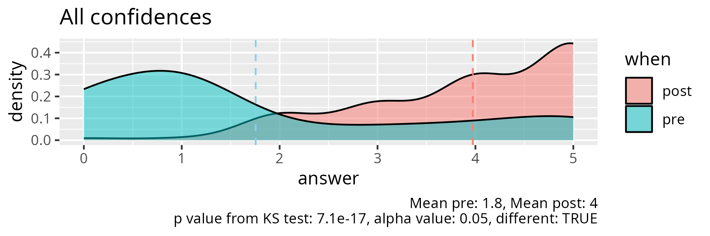
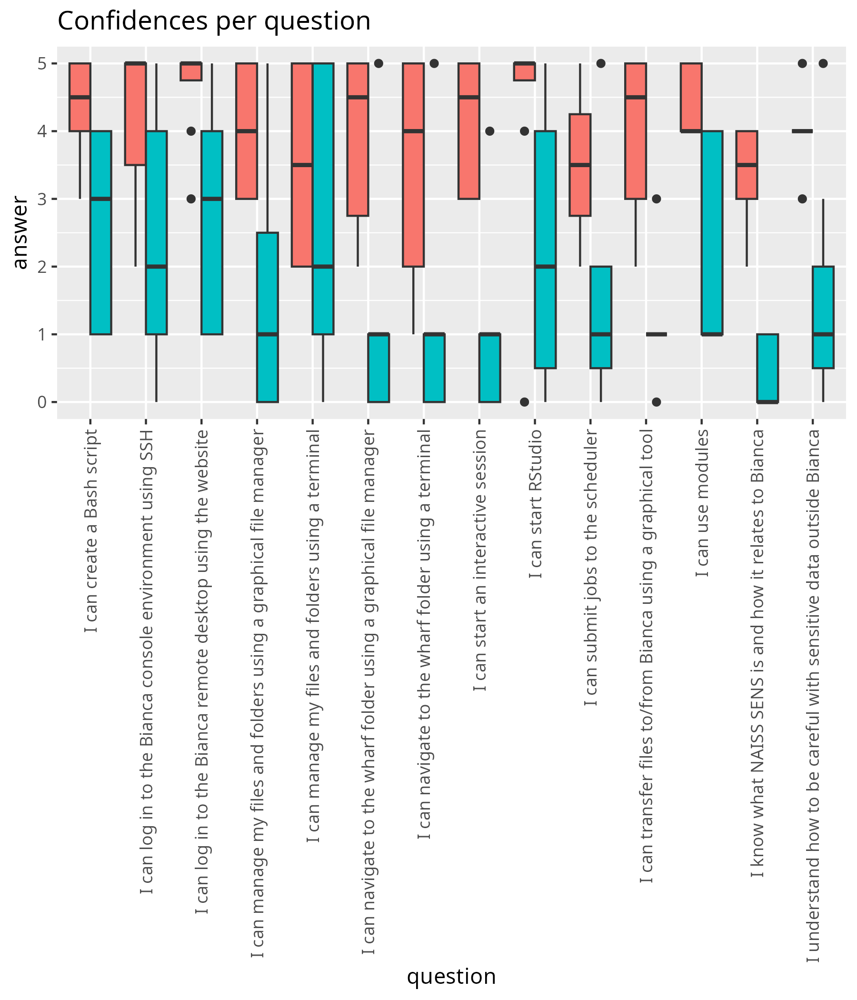

# Evaluation

- Course: Basic
- Date: 2026-12-05
- Number of registrations: ?
- Number of learners showing up: 9 (?% show-up rate)
- Number of evaluation results: 8 (89% fill-in rate)
- [Analysis script (R)](analyse.R)
- [average_confidences.csv](average_confidences.csv)
- [success_score.txt](success_score.txt): 79%

## [Any feedback?](any_feedback.csv)

- The menti quiz was a nice way to solidify the concepts
- I found the class informative, and very useful.
  For someone relatively new to interacting with HPCs,
  this was difficult, but not impossible.
  When I came upon an issue, or something wasn't clear,
  the staff was helpful and patient.
  I felt comfortable to ask ""dumb"" questions."

## [comments.txt](comments.txt)

- I really liked the breakout rooms,
  but it was also nice to have more like "lectures" for some topics.
- A good course with a very responsive and flexible teaching team
- Good course overall, would benefit from using
  winSCP as an alternative to Filezilla
- Very good course! I was afraid that it would be to fast paced or
  hard to follow but realized that the course was mainly
  a chance to explore all the material that is already around.
- Unfortunately, I missed the info that one should create a login in advance
  and then it was to late so it could be helpful to write that in the
  SCore/NAISS overview with the link for the registration
  that the course requires some setup.
- Richèl is an enthusiastic teacher! Great work!
- Great course as an introduction to Linux bash coding and HPC clusters use.
  Specially helpful when teachers (Richel, Björn, Jayant)
  explain things along the course material.
  The small rooms system is also good to work in teams
  to follow the instructions. 
- I think the structuring of the course can be improved.
  On the first, second and third day we already worked with HPC clusters,
  but i didn't really understand what an HPC cluster until the las day.
  Maybe first focus only on Linux coding and
  then proceed with HPC clusters and applications. 
- This course is very extensive and introduces you to
  advanced computational resources.
  I know feel that I know the basics of coding in Linux and that,
   with some guidance, I can fin my way in order to work with a HPC cluster.
  The last day had the biggest learning outcome,
  and have made me keen to taking more courses on the topic.
  Thank you to all the teachers involved.
- Thank you for all of the help this week.
  It was incredibly useful for a newbie like myself trying to engage with HPCs.

## Pre-post analysis

- [analyse_pre_post.R](analyse_pre_post.R)
- [stats.md](stats.md)

|question                                                          |  mean_pre| mean_post|   p_value|different |
|:-----------------------------------------------------------------|---------:|---------:|---------:|:---------|
|I understand how to be careful with sensitive data outside Bianca | 1.5714286|     4.000| 0.0189562|TRUE      |
|I know what NAISS SENS is and how it relates to Bianca            | 0.4285714|     3.375| 0.0010939|TRUE      |
|I can log in to the Bianca remote desktop using the website       | 2.7142857|     4.625| 0.0367280|TRUE      |
|I can log in to the Bianca console environment using SSH          | 2.4285714|     4.125| 0.0979120|FALSE     |
|I can navigate to the wharf folder using a graphical file manager | 1.1428571|     3.875| 0.0106132|TRUE      |
|I can manage my files and folders using a graphical file manager  | 1.5714286|     4.000| 0.0445310|TRUE      |
|I can navigate to the wharf folder using a terminal               | 1.1428571|     3.500| 0.0208344|TRUE      |
|I can manage my files and folders using a terminal                | 2.7142857|     3.500| 0.4323552|FALSE     |
|I can create a Bash script                                        | 2.5714286|     4.375| 0.0180436|TRUE      |
|I can use modules                                                 | 2.2857143|     4.375| 0.0108269|TRUE      |
|I can transfer files to/from Bianca using a graphical tool        | 1.1428571|     4.000| 0.0023273|TRUE      |
|I can start an interactive session                                | 1.0000000|     4.125| 0.0045637|TRUE      |
|I can submit jobs to the scheduler                                | 1.5714286|     3.500| 0.0295388|TRUE      |
|I can start RStudio                                               | 2.2857143|     4.250| 0.0888040|FALSE     |
