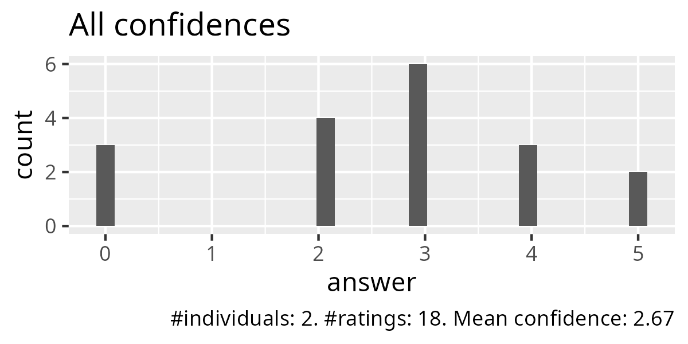
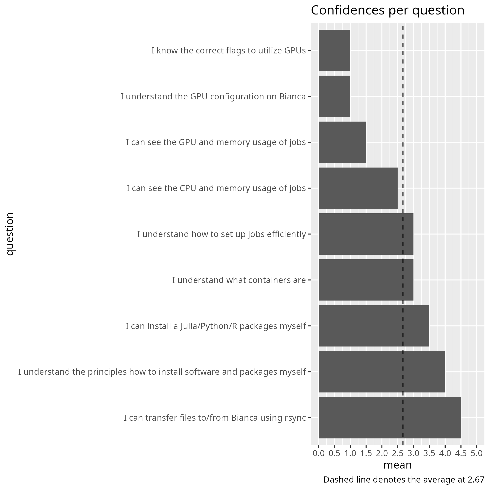
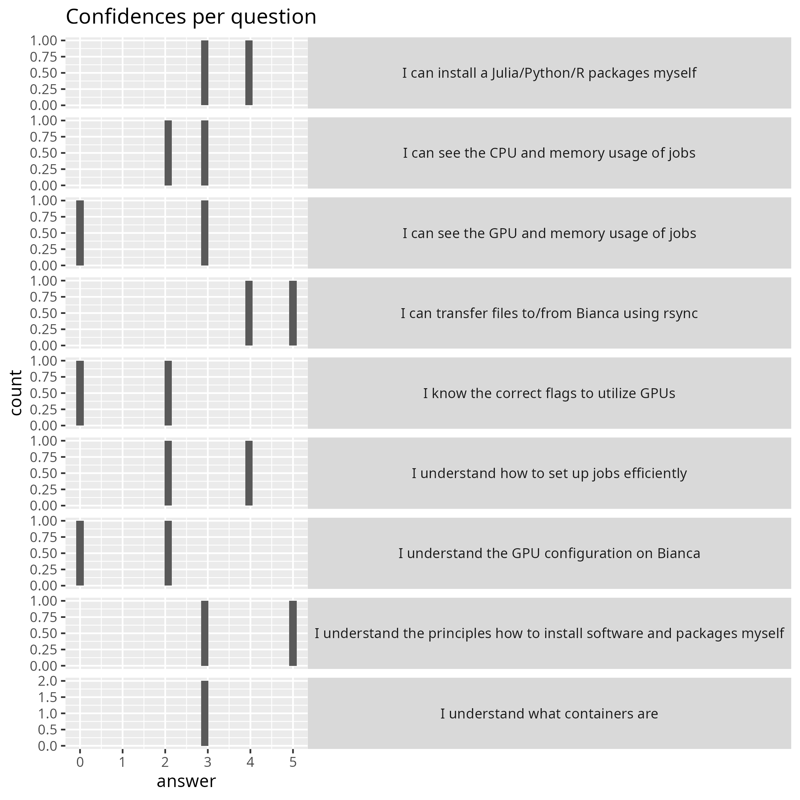
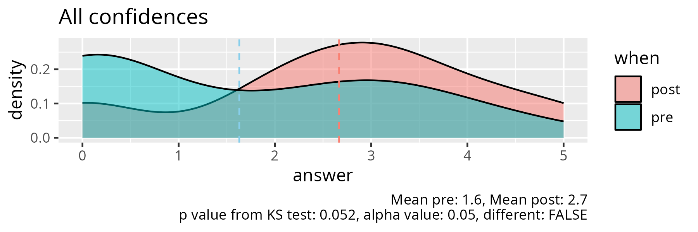
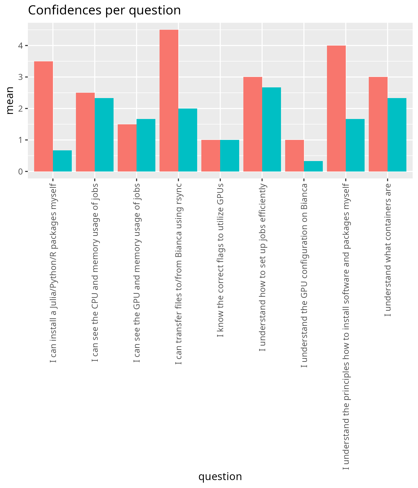
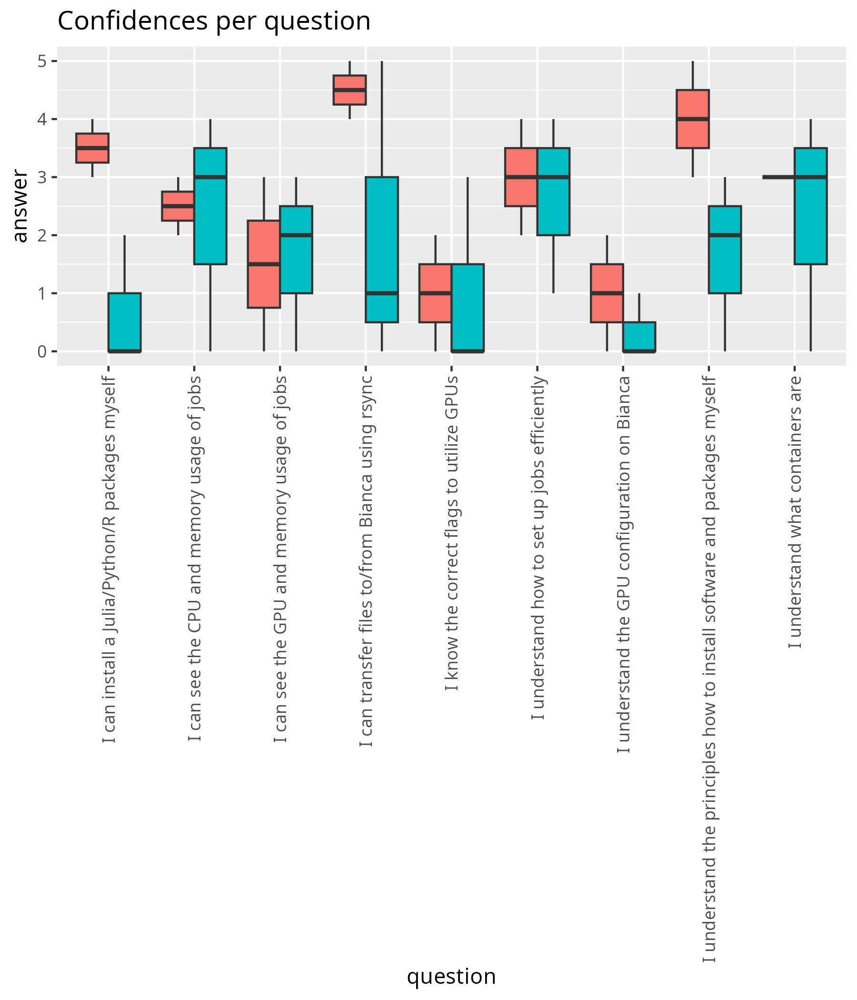
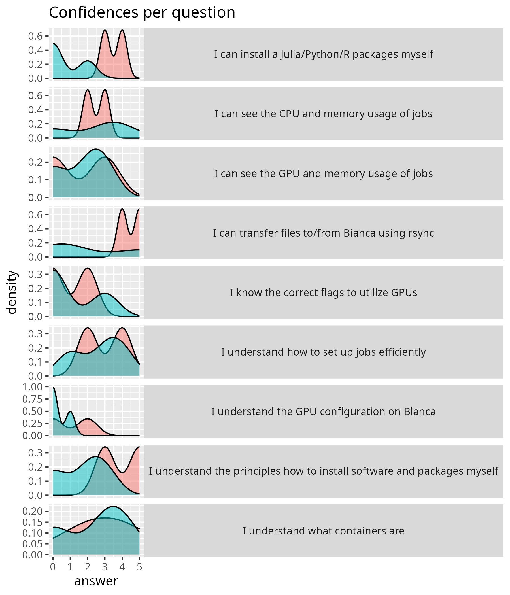

# Evaluation

- Date: 2026-05-22
- Course: Intermediate
- [Lesson plan](../../lesson_plans/20260522/20260522_richel.md)
- [Evaluation](../../evaluations/20260522/README.md)
- [Reflection](../../reflections/20260522/20260522_richel.md)
- [Analysis script (R)](analyse.R)
- [average_confidences.csv](average_confidences.csv)
- [success_score.txt](success_score.txt): 53%

## [comments.txt](comments.txt)

- Thanks to all the teacher. Since we were a small group today
  we could really get the help we needed and that was really valuable.
- The section about GPUs and nodes should have started a bit more basic.
  Even though I work on Bianca,
  I have limited knowledge of basic computer science. Like what is A100? 
- Nice course, good hands on help when needed.

## Pre-post analysis

- [analyse_pre_post.R](analyse_pre_post.R)
- [stats.txt](stats.txt)

|question                                                                |  mean_pre| mean_post|   p_value|different |
|:-----------------------------------------------------------------------|---------:|---------:|---------:|:---------|
|I can transfer files to/from Bianca using rsync                         | 2.0000000|       4.5| 0.5536170|FALSE     |
|I can see the GPU and memory usage of jobs                              | 1.6666667|       1.5| 1.0000000|FALSE     |
|I know the correct flags to utilize GPUs                                | 1.0000000|       1.0| 1.0000000|FALSE     |
|I understand the GPU configuration on Bianca                            | 0.3333333|       1.0| 0.7468856|FALSE     |
|I can see the CPU and memory usage of jobs                              | 2.3333333|       2.5| 1.0000000|FALSE     |
|I understand how to set up jobs efficiently                             | 2.6666667|       3.0| 1.0000000|FALSE     |
|I understand the principles how to install software and packages myself | 1.6666667|       4.0| 0.2361370|FALSE     |
|I can install a Julia/Python/R packages myself                          | 0.6666667|       3.5| 0.1386406|FALSE     |
|I understand what containers are                                        | 2.3333333|       3.0| 1.0000000|FALSE     |
