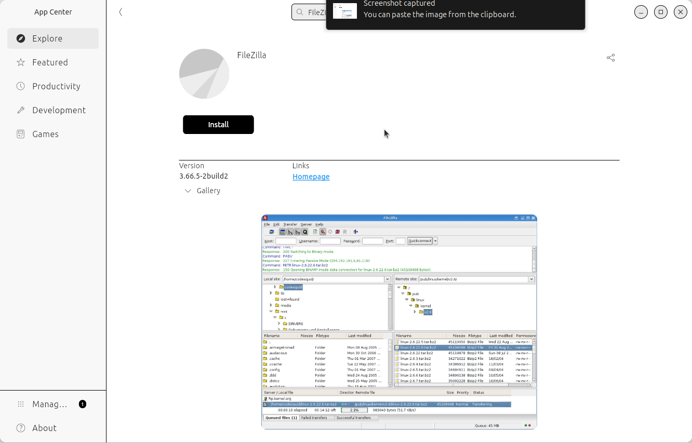

---
tags:
  - FAQ
  - frequently asked questions
  - questions
---

# Frequently Asked Questions

## When to follow the basic course

### When should I follow the basic course?

When you want to be able to work with the Bianca HPC cluster.

### When should I consider to **not** follow the basic course?

These are the reasons to consider to **not** follow the basic course:

#### Basic: Reason 1: you want to learn advanced things

When you already work with Bianca and
expect to learn new and more advanced things.

In this case, the course will go too slow for you.

However, you will probably be put to work by the teachers
to help out other learners.
If you like to test your own knowledge by teaching others,
you will likely thrive in the course.

#### Basic: Reason 2: you have social anxiety

When you have social anxiety.

In this case, the course will be too social for you.

However, in this course, it is perfectly OK to give a wrong
answer or to say 'I do not know'. This is what a former
learner had to say on this:

You are welcome to try and leave anytime you want.
The course material is made for self-study too, with videos
for all exercises.
Do fill in [the beginner course's evaluation](../beginner/evaluation.md)
or [the intermediate course's evaluation](../intermediate/evaluation.md)
when you leave early :-)

## When to follow the intermediate course

### When should I follow the intermediate course?

When you want to be able to work better with the Bianca HPC cluster.

### When should I consider to **not** follow the intermediate course?

These are the reasons to consider to **not** follow this course:

#### Intermediate: Reason 1: you want to learn the basics

When you have never worked with Bianca,
you want to learn the basics.

In this case, the course will be unsuitable for you.

Consider following the basis Bianca course.

#### Intermediate: Reason 2: you have social anxiety

When you have social anxiety.

In this case, the course will be too social for you.

However, in this course, it is perfectly OK to give a wrong
answer or to say 'I do not know'. This is what a former
learner had to say on this:

You are welcome to try and leave anytime you want.
The course material is made for self-study too, with videos
for all exercises.
Do fill in [the evaluation](../intermediate/evaluation.md)
when you leave early :-)

## Prerequisites

### What are the prerequisites for following this course?

See [prerequisites](../prereqs.md).

### How can I check if I have registered?

Contact the course coordinator,
[Diana Iusan](https://www.uu.se/en/contact-and-organisation/staff?query=N5-245)

### How to find the course's Zoom room?

It will be emailed to you.

### How can I check if I have a NAISS account?

When you can login at [https://supr.naiss.se/](https://supr.naiss.se/).

???- question "How does that look like?"

    It should look similar to this:

    

### How can I check if I can login to Bianca using SSH?

It look similar to this:


### How can I login to Bianca?

Follow the instructions of your favorite HPC center
or [the UPPMAX instruction](https://docs.uppmax.uu.se/getting_started/login_rackham_console_password/)

Also, these videos may be useful:

<!-- markdownlint-disable MD013 --><!-- Tables cannot be split up over lines, hence will break 80 characters per line -->

HPC cluster|Login method |Documentation                                                                                   | Video
-----------|-------------|------------------------------------------------------------------------------------------------|------
Bianca     |Website      |[Documentation](https://docs.uppmax.uu.se/getting_started/login_bianca_remote_desktop_website/) | [Video](https://youtu.be/Ni9nyCf7me8)
Bianca     |SSH          |[Documentation](https://docs.uppmax.uu.se/getting_started/login_bianca_console_password/)       | [Video](https://youtu.be/7mKDxnXqi_M)

<!-- markdownlint-enable MD013 -->

## How to install MobaXterm?

This is for Windows users only.

Install MobaXterm from [the MobaXterm website](https://mobaxterm.mobatek.net/).

## How to check that I've installed MobaXterm?

Run it. If it shows up, you've installed MobaXterm.

## How to install `rsync`?

This is for Linux and Mac users only.

For Linux, in a terminal, run:

```bash
sudo apt install rsync
```

For Max, in a terminal, run:

```bash
brew rsync
```

## How to check that I've installed `rsync`?

In a terminal, type:

```bash
rsync --version
```

If you see the `rsync` version displayed, you've installed `rsync`.

???- question "How does that look like?"

    Your output will look similar to this:

    ```bash
    richel@richel-N141CU:~$ rsync --version
    rsync  version 3.2.7  protocol version 31
    Copyright (C) 1996-2022 by Andrew Tridgell, Wayne Davison, and others.
    Web site: https://rsync.samba.org/
    Capabilities:
        64-bit files, 64-bit inums, 64-bit timestamps, 64-bit long ints,
        socketpairs, symlinks, symtimes, hardlinks, hardlink-specials,
        hardlink-symlinks, IPv6, atimes, batchfiles, inplace, append, ACLs,
        xattrs, optional secluded-args, iconv, prealloc, stop-at, no crtimes
    Optimizations:
        SIMD-roll, no asm-roll, openssl-crypto, no asm-MD5
    Checksum list:
        xxh128 xxh3 xxh64 (xxhash) md5 md4 sha1 none
    Compress list:
        zstd lz4 zlibx zlib none
    Daemon auth list:
        sha512 sha256 sha1 md5 md4

    rsync comes with ABSOLUTELY NO WARRANTY.  This is free software, and you
    are welcome to redistribute it under certain conditions.  See the GNU
    General Public Licence for details.
    ```

## Should I install FileZilla or WinSCP?

FileZilla.

However, if you are not allowed to install FileZilla
and WinSCP is available, use WinSCP.

## What if I cannot install FileZilla nor WinSCP?

Then you cannot do the exercises in
session [File transfer using a graphical tool](../beginner/file_transfer_using_gui.md).

Instead, pick among
[the multiple Bianca file transfer methods](https://docs.uppmax.uu.se/cluster_guides/transfer_bianca/#file-transfer-methods).
that works on your computer.

## How to install FileZilla?

Under Ubuntu, you can can use the Ubuntu App Center.

???- question "How does the Ubuntu App Center look like?"

    Here:

    

For non-Ubuntu users, search the web, download and install.

???- question "Where can I find it?"

    The FileZilla website can be found at
    [https://filezilla-project.org/](https://filezilla-project.org/).

    Clicking on 'Download FileZilla client' takes you to the
    FileZilla download page at
    [https://filezilla-project.org/download.php?type=client](https://filezilla-project.org/download.php?type=client).

    Download the file, maybe unzip it and run the installer

## How to check that I've installed FileZilla?

Run it. If it shows up, you've installed FileZilla.

## How to install WinSCP?

Go to [the WinSCP download page](https://winscp.net/eng/download.php),
download it and run the installer

## How to check that I've installed WinSCP?

Run it. If it shows up, you've installed WinSCP.

### How can I check if I have a good Zoom setup?

- You are in a room where you can talk
- You talk into a (standalone or headset) microphone
- Others can clearly hear you when you talk
- Others can see you
- You can hear others clearly when they talk

### How can I get a good Zoom setup?

- Find/schedule/book a room where you can talk
- Buy a simple headset

### What if I don't have a good Zoom setup? Is that OK?

No.

You will feel left out, as the course in highly interactive.
It would be weird to the other learners.

## Teaching

### Why is the course learner-centered?

Because that is good teaching.

This course defines good teaching as 'evidence-based methods to let learners
acquire new skills and the monitoring of this acquisition'.
This means that it should be observed that learners need more/less to time
to practice and following the schedule based on that. Learner-centered teaching
has an effect size from 0.36 `[Hattie ranking]`
or 0.64/0.70 `[Cornelius-White, 2007][Hattie, 2012]`.

## Website

### Why is the repository owner `UPPMAX` instead of NAISS?

Because NAISS does not have a GitHub owner page yet.

### How did you do the NAISS color gradient at the top of the MkDocs page?

By adding the lines below to [the style sheet](../stylesheets/extra.css):

```text
.md-header {
  background: linear-gradient(to right, #4b0029, #010088);
  color: white
}
.md-tabs {
  background: linear-gradient(to right, #4b0029, #010088);
  color: white
}
```

## References

- `[Cornelius-White, 2007]` Cornelius-White, Jeffrey.
  "Learner-centered teacher-student relationships are effective:
  A meta-analysis." Review of educational research 77.1 (2007): 113-143.
- `[Hattie, 2023]` Hattie, John. Visible learning:
  The sequel: A synthesis of over 2,100 meta-analyses relating to achievement.
  Routledge, 2023. The effect size of lecturing can be found on page 363,
  which has an effect size of -0.26 with a robustness index of 4 out of 5
  and is based on 3 meta analyses using 273 studies using 27,296 people,
  measuring for 614 effects with a standard error of 0.08.
  One example open access study is `[Knight & Wood, 2005].`
- `[Hattie ranking]` [The Hattie Ranking](https://visible-learning.org/hattie-ranking-influences-effect-sizes-learning-achievement/)
- `[Knight & Wood, 2005]` Knight, Jennifer K., and William B. Wood.
  "Teaching more by lecturing less." Cell biology education 4.4 (2005): 298-310.
  [paper](https://www.lifescied.org/doi/full/10.1187/05-06-0082)
