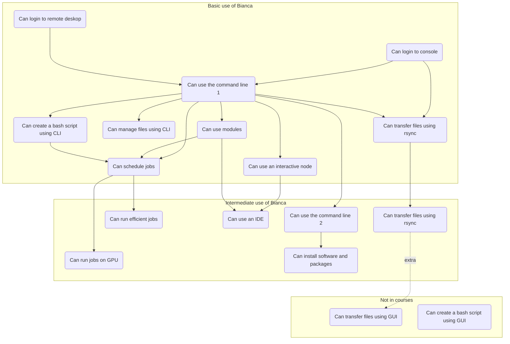

---
tags:
  - lesson
  - session
---

# Bianca In-Depth Hackathon: Improve Your Handling of Sensitive Research Data

!!!- info "Learning outcomes"

    - I have read the topics discussed today
    - I can find the link to the shared document
    - I can find the schedule

???- question "For teachers"

    Prerequisites are:

    - Link to shared document

    Teaching goals are:

    - Learners have read the topics discussed today
    - Learners can find the link to the shared document
    - Learners can find the schedule

    Prior questions:

    - What do you think about when you think about Bianca?
    - How would you like to improve your Bianca experience?

Are you already working with sensitive data in your research
and feel your workflow can be improved?
If yes, welcome to a full day of learning of smarter ways
to work on the Bianca UPPMAX cluster.

???- tip "Help! I am new to Bianca, where do I start instead?"

    As a beginner, you are encouraged to start with
    [the beginner Bianca course](../beginner/intro.md).

    This course assumes you have worked with Bianca for longer
    and there is no time scheduled to get a Bianca beginner up to speed.

!!! info "Course shared document"

    The course shared document can be found at:
    [https://hackmd.io/@UPPMAX/bianca-workshop-2024/edit](https://hackmd.io/@UPPMAX/bianca-workshop-2024/edit).

    It contains exercises, room for questions and room for feedback.

    To view the shared document in both text and rendered form,
    click on the button in the top between the pen and eye.

    Regarding questions:

    - create a new line for new questions
    - take care if others are editing at the same time
    - the more teaching assistants available, the quicker questions are answered
    - some questions may be answered after the workshop


- [Schedule](schedule.md)
- [Course dates](course_dates.md)

## Overview of courses



## Exercises

### Exercise 1: today's topic

In this exercise, we will find out today's learning objectives.

The goal of these questions is to introduce what is taught
today, as well as measuring how much knowledge is gained at the end
of the day.

- Fill in [this form](https://docs.google.com/forms/d/e/1FAIpQLSeXGoGlfFZpdmLEvfxlBq82IjaVwhz3kowXRT4ijsZe1bOWDA/viewform?usp=header)

???- question "What is in that form?"

    In this exercise, we will find out today's learning objectives.

    The goal of these questions is to introduce what is taught
    today, as well as measuring how much knowledge is gained at the end
    of the day.

    Give you confidence levels of the following statements,
    using this scale:

    - 0: I don't know even what this is about ...?
    - 1: I have no confidence I can do this
    - 2: I have low confidence I can do this
    - 3: I have some confidence I can do this
    - 4: I have good confidence I can do this
    - 5: I absolutely can do this!

    Give you confidence levels of the following statements below:

    - I can transfer files to/from Bianca using `rsync`
    - I can see the GPU and memory usage of jobs
    - I know the correct flags to utilize GPUs
    - I understand the GPU configuration on Bianca
    - I can see the CPU and memory usage of jobs
    - I understand how to set up jobs efficiently
    - I understand the principles how to install software and packages myself
    - I can install a Julia/Python/R packages myself
    - I understand what containers are
    - I can can run the voted-for IDE on Bianca
    - I understand how to deal with sensitive data

    Is there a learning objective you think is missing? What is it?

    ```code
    [Free text paragraph]
    ```
