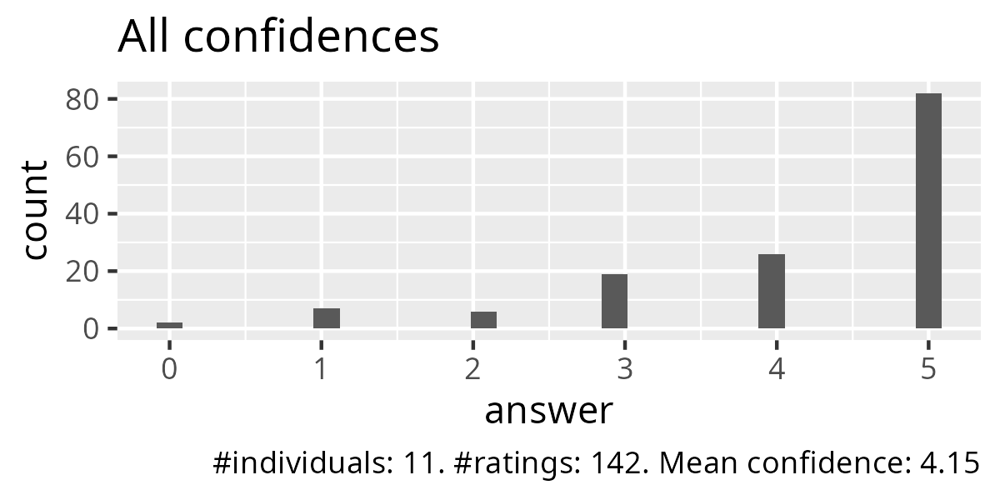
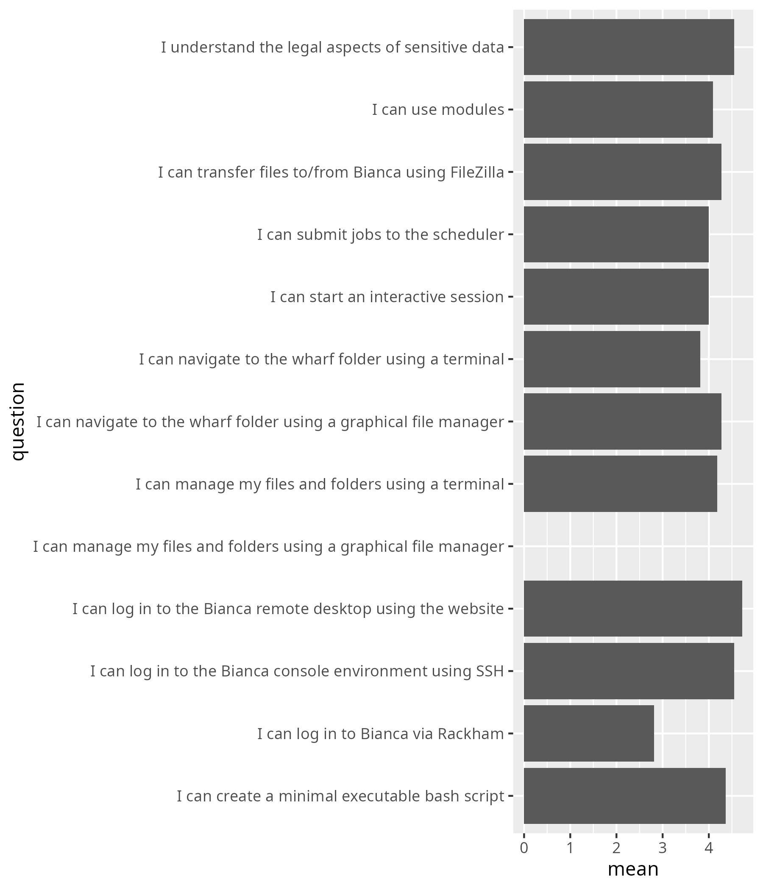
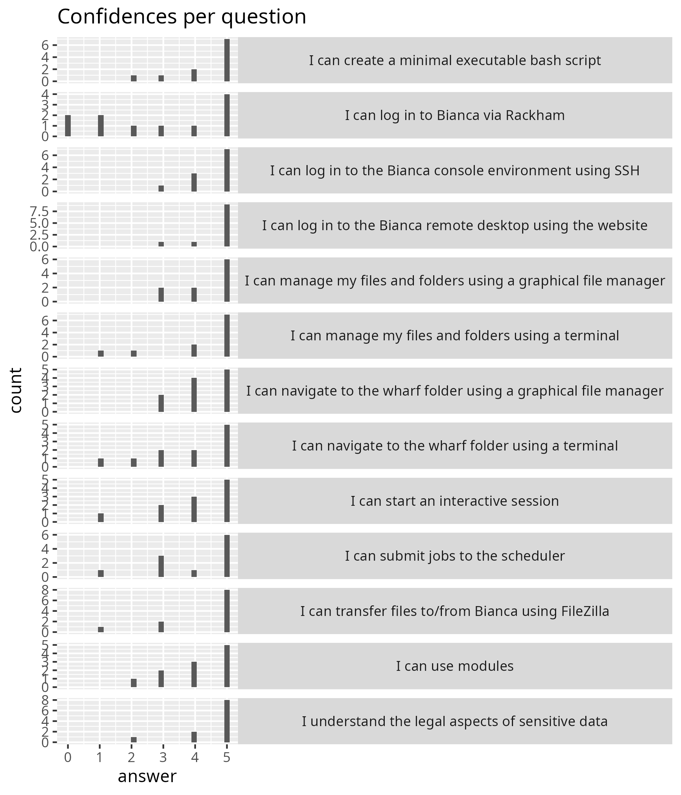

# Reflection

- Author: Richel
- Course: Intro to Bianca
- Date: 2025-03-19
- Number of registrations: 24
- Number of learners: 11
- Number of evaluations: 11 (100%)
- Success score: 85%
- Learners making use of the Q&A: 1 (out of 11, hence 9%)
- Lesson plan: [Richel](../../lesson_plans/20250319/20250319_richel.md)
- [Evaluation](../../evaluations/20250319/README.md)

## Schedule

I felt comfortable with my morning session, the 'Legal aspects of sensitive
data' session would be done by me, as decided around 12:30.

<!-- markdownlint-disable MD013 --><!-- Tables cannot be split up over lines, hence will break 80 characters per line -->

When  | Who  | What
------|------|-----------------------------
9:00  | R    | Introduction, login, log in to remote desktop, use the remote desktop
10:00 | .    | Break
10:15 | R    | log in to remote desktop, use the remote desktop, :rocket: Log in to console environment, :rocket: command line
11:00 | .    | Break
11:15 | R    | Create an executable script, use modules
12:00 | .    | Lunch
13:00 | P    | Transferring files to and from Bianca using FileZilla
13:55 | .    | Break
14:05 | B    | Compute nodes and SLURM, including interactive nodes
14:55 | .    | Break
15:10 | R    | Legal aspects of sensitive data
15:30 | R    | Summary and anonymous evaluation
15:45 | All  | Optional Q&A

<!-- markdownlint-enable MD013 -->

I had prepared well, slept well and felt fine.

## First half

The teaching session went well I think, with the biggest problem at the
start. This biggest problem was an unfortunate couple in the break-out rooms,
with 1 learner having no access to Bianca, and the other learner feeling
uncomfortable with computers. It was clear in the body language of the
second, that she was agitated. I ruthlessly re-coupled these learners
with two of my UPPMAX colleagues. After 10 minutes, it was very clear
that this was the right call, which again could be seen clearly in the
body language of the second learner. This problem turned into my
favorite moment of these sessions!

At the start of the introduction, there was a link to a shared
document. I asked the two other teachers if they used it.
One replied with a 'no', the other may not have heard it (for good
reasons), yet I decided not to take more time in asking.
Instead, I'll suggest via an issue to remove the shared document.

- [x] [Suggest to remove the shared document](https://github.com/UPPMAX/bianca_workshops/issues/60)

I've made the console login optional, as well as using the command-line:
there was no time for this. I've seen in my last reflection:

> - [ ] Discuss either moving SSH login to the Intermediate course,
> or request 45 minutes more time

This has not happened. At least, I do not remember any meeting on the
Bianca courses. I assume that, if they took place, they took place
before/after the UPPMAX weekly meeting.

One learner did not have a good Zoom setup.
This needed not be and definitely did not help her.

- [x] [Suggest to make 'A good Zoom setup' more prominent in the prerequisites](https://github.com/UPPMAX/bianca_workshops/issues/59)

The prerequisites were in a long Word document. Some learners indicated
that this was a complex document. I agree. There were no screenshots
and no video.

- [x] [Suggest to move the prerequisites document to our website](https://github.com/UPPMAX/bianca_workshops/issues/61)
  and simplify

What I missed in my intro is to tell about Bianca: why use her?
[Add this to the priors](https://github.com/UPPMAX/bianca_workshops/issues/65).

## Second half

After preparing, I came back a bit earlier
to taste the atmosphere of the course.
The learners seemed to still be in a good mood.

As an earlier session needed more time,
I had 6 minutes to teach NAISS sens and I was fine with that.
It was one session of monologue teaching, which I said would be
close to useless, but at least they've seen what to expect.

Evaluations went smoothly.
Q&A had 1 learner using it, hence 9% did use it. I think it can be removed.

- [x] [Suggest to remove scheduled time for Q&A](https://github.com/UPPMAX/bianca_workshops/issues/62)

## Evaluation

From [Average confidences (.csv)](../../evaluations/20250319/average_confidences.csv)
I get:

<!-- markdownlint-disable MD013 --><!-- Tables cannot be split up over lines, hence will break 80 characters per line -->

question                                                         |mean|Note
-----------------------------------------------------------------|----|----
I can log in to the Bianca remote desktop using the website      |4.7 |Fair
I can log in to the Bianca console environment using SSH         |4.5 |Fair
I understand the legal aspects of sensitive data                 |4.5 |Taught in 7 minutes ...?
I can manage my files and folders using a graphical file manager |4.4 |Fair
I can create a minimal executable bash script                    |4.3 |Fair
I can navigate to the wharf folder using a graphical file manager|4.2 |Fair
I can transfer files to/from Bianca using FileZilla              |4.2 |Fair
I can manage my files and folders using a terminal               |4.1 |Fair
I can start an interactive session                               |4   |Fair
I can submit jobs to the scheduler                               |4   |Fair
I can use modules                                                |4.0 |Fair
I can navigate to the wharf folder using a terminal              |3.8 |Fair: this was not taught to all
I can log in to Bianca via Rackham                               |2.8 |Not taught

<!-- markdownlint-enable MD013 -->

These grades feel higher/better than would be fair: the untaught
session got a 2.8 already. I feel some learners were a bit too
happy :-) . Let's celebrate this over criticizing this, I guess :+1:.

Maybe this worked so well, because there were so many UPPMAX colleagues...?

## Anonymous feedback

- Good course and nicely interactive with lots of time for exercises.
  I also want to thank all that were involved in
  creating the uppmax documentation,
  which is the real helper for me in the future,
  since I will probably not recall much from the course in a few months!
- The schedule and efficiency of the program was great.
- Some of the instructions we follow were a bit unclear
  for someone who knows just a little bit.
  For example, Like creating a text file, it didn't say where you should do it.
  So i guessed.
  But overall I really liked the course

This is a great suggestion! And I wish the learner had given more
such examples, as I can implement each of the given examples.
I will [improve the explanation on where to create a text file](https://github.com/UPPMAX/bianca_workshops/issues/63).

- The lectures were very informative,
  and I will be able to use a lot of the things I learned in my projects.
- Improving titles of Subsections would facilitate going through the
  documentation alone.
  For example, the title Why? is not very clear on the question itself.
  Thanks for the time, it was fun and useful.

The learner is right:
[I will reconsider the titles of subsections](https://github.com/UPPMAX/bianca_workshops/issues/64).

- Thanks to all teachers: Björn, Pavlin and Richèl!
  Nice introduction and nice interactive !!!
- Thank you for a very helpful course!
  I am very happy to have taken it and it will certainly help me.
  I would like to add, however, that I was surprised that the
  file transfer-session was mostly about using the terminal
  (even though the course summary clearly indicated graphic file
  manager - and the terminal handling was for more advanced students).
  Also, I think it would be a good idea to tell students beforehand
  to download e.g. Filezilla or WinSCP (which I am not used to at all)
  rather than MobaXterm.
  I had no use of downloading MobaXterm (which was quite buggy to be honest)
  during the course as I was taught that you could access a terminal
  via desktop Bianca.
  These are just a few bits of feedback.
  But as I mentioned to begin with, I think you did a good job.

Unsure why the terminal and WinSCP were mentioned in the FileZilla
sessions. I've added installing FileZilla to the prereqs :-)

- Thank you for a well structured introduction and a meaningful day!
  Regarding confidence to do things, I will still need written instructions.
  The afternoon sessions: here I spent to much time installing the "support"
  software needed and thus did not have time to try and transfer files.
  I suggest that you prepare participants even more in detail
  by adding a list on the type of software we need to do these things.
  Now I tried unsuccessfully with both FileZilla and WinSCP,
  but have some hope of managing this at some point.
  I think it worked out rather well -all in all- for me as a beginner
  and as such also a person without no prior knowledge
  or skills when it comes to scripts etc.
- The course was amazing, thank you so much for this!
  Just a couple of corrections to the course material.
  On page:
  <https://uppmax.github.io/bianca_workshops/beginner/file_transfer_using_gui/>
  You say, under section '3b. Locate that file on Bianca using the graphical
  file explorer': "Its location is at
  `/home/[user_name]/[project_name]/nobackup/wharf/[user_name]/[user_name]-[project_name]`,
  for example, at `/home/sven/sens123456/nobackup/wharf/sven/sven-sens123456.`"
  There is no such directory.
  Then you repeat that same information under section
  '3c. Locate that file on Bianca using the terminal':
  "Its location is at
  `/home/[user_name]/[project_name]/nobackup/wharf/[user_name]/[user_name]-[project_name]`,
  for example, at `/home/sven/sens123456/nobackup/wharf/sven/sven-sens123456.`"
  Again, there is no such directory.
  On page: <https://uppmax.github.io/bianca_workshops/beginner/transfer_basics/>
  You say under section '#the-wharf-location-on-bianca':
  "The path to this folder, once you are logged into your project's cluster, is:
  `/proj/<projid>/nobackup/wharf/<username>/<username>-<projid>`
  E.g. `/proj/sens2025560/nobackup/wharf/myuser/myuser-sens2025560`"
  But the real path is actually:
  "`/proj/**nobackup**/<projid>/wharf/<username>/<username>-<projid>/`"

Done!
